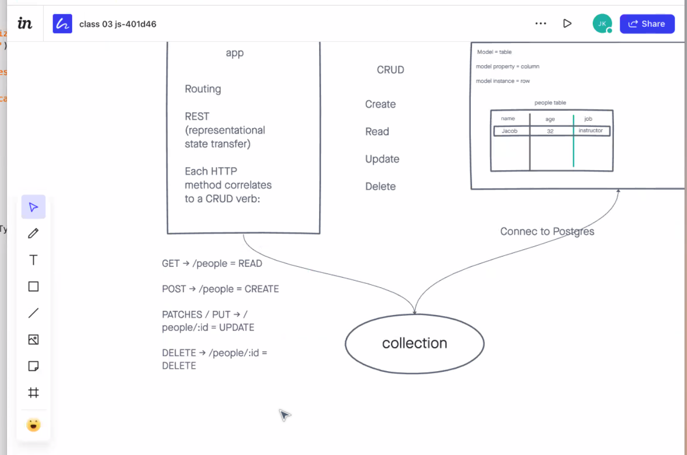

# BASIC API SERVER WITH CRUD
DEPLOYED @ [LINK TO DEPLOYED SITE](https://basic-express-server-tp.herokuapp.com/person?name=tom)
A useless HTTP server for demonstration purposes.

## coming soon!
;

## Installation

1. Clone from this repo `git clone (green button near top of repo)`
1. cd into <REPO_NAME>
1. `npm install`

## Usage

Once installed, run `npm start`

## Contributors / Authors

- Tanner Percival

## Features / Routes

- GET : `/person`
  - Parameters
    - must include a person as a route parameter.
    - must include a text property on the request query.
  - Response
    - status 200, and string body if parameters look good.
      - query: name`
    - status 400, if no text is present.
- PUT : `/person/:id`
  - Parameters
    - must include a person as a route parameter.
    - must include a text property on the request query.
  - Response
    - status 200, and string body if parameters look good.
      - query: name`
    - status 400, if no text is present.
- DELETE : `/person/:id`
  - Parameters
    - must include a person as a route parameter.
    - must include a text property on the request query.
  - Response
    - status 200, and string body if parameters look good.
      - query: name`
    - status 400, if no text is present.
- GET 1 : `/person/:id`
  - Parameters
    - must include a person as a route parameter.
    - must include a text property on the request query.
  - Response
    - status 200, and string body if parameters look good.
      - query: name`
    - status 400, if no text is present.
